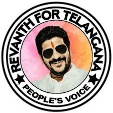
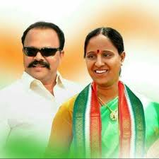
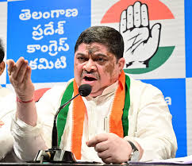
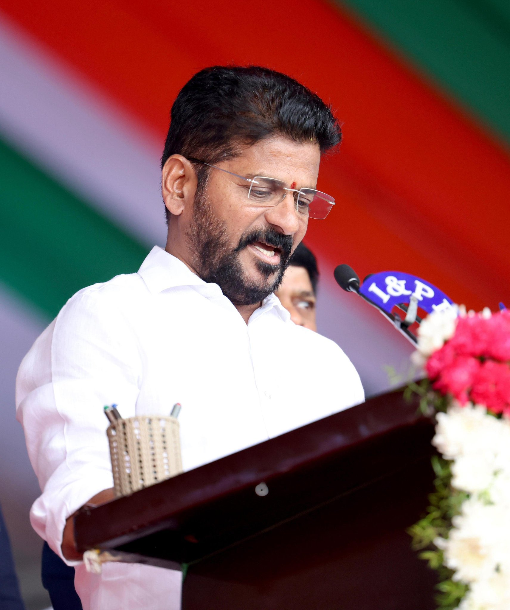
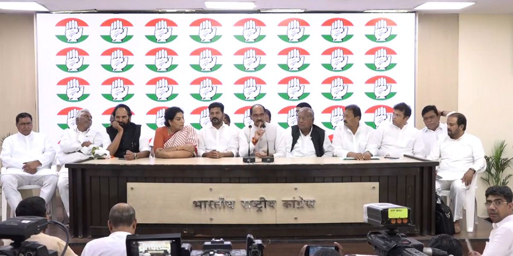
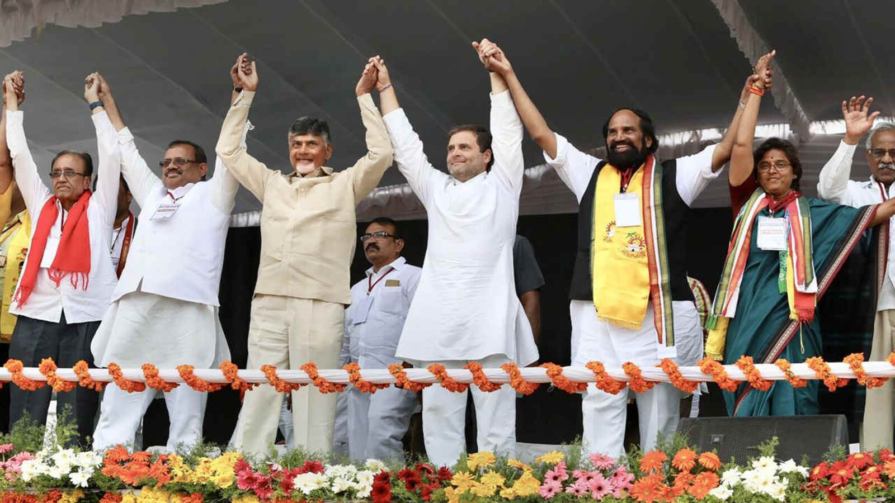

# congress
leaders 
<!DOCTYPE html>
<html lang="en">
<head>
    <meta charset="UTF-8">
    <meta name="viewport" content="width=, initial-scale=1.0">
    <title>Document</title>
    <link rel="stylesheet" href="style2.CSS">
</head>
<body class="rang">
    

        <h1 class="heading">CONGRESS LEADER</h1>
        <h3 class="angle">Cheif Minister of Telangana</h3>
        
        
<b>Anumula Revanth Reddy</b>

        
RR is an indian politican who is serving as the secound and current <i>Cheif Minister of Telangana</i> since 7 December 2023. 

        
As a member of the Indian National Congress, he is the current MLA for kodangal

        
ఎనుముల రేవంత్ రెడ్డి, రాష్ట్ర రెండవ ముఖ్యమంత్రిగా రేవంత్ ఎన్నికయ్యాడు. అతను 2023 తెలంగాణా శాసనసభ ఎన్నికలలో కొడంగల్ నియోజకవర్గం నుండి శాసనసభ్యుడుగా ఎన్నికయ్యాడు.

        <a href="http://youtube.com/watch?v=FWgKmMz1Rjg">
            <button class="youtube">Clicke here for more info</button>
        </a>
    

    
 
        <ul>
            <li>REVANTH REDDY</li>
            <li>HYDERABAD</li>
        </ul>
         
        <ol class="rangu0">
            <li>CHEIF MINISTER</li>
            <li><a href="index.html" style="color: rgb(41, 220, 229)";>TELANGANA</a></li>
        </ol>
         
        <table border="1" cellpadding="20">
            <tr class="rangu">
                <th>S.NO</th>
                <th>MLA name</th>
                <th>area</th>
            </tr>
            <tr>
                <td><b>1</b></td>
                <td><a href="https://www.oneindia.com/politicians/anumula-revanth-reddy-50579.html">REVANTH REDDY</a></td>
                <td>KODANGAL</td>
            </tr>
            <tr class="rangtt">
                <td><b>2</b></td>
                <td><a href="https://www.oneindia.com/politicians/konda-surekha-51068.html" class="ranga">KONDA SUREKHA</a></td>
                <td>WARANGAL</td>
            </tr>
        </table>  
    

    

        <form class="ravv">
            <label for="name">Name:</label>
            <input type="text" id="name" name="name" placeholder="Enter your name here">
              
            <label for="Area">Area:</label>
            <input type="text" id="Area" name="Area" placeholder="Enter your Area here">
             
             
            <label for="position">Present Position of</label> 
            <input type="radio" id="position" value="MLA">
            <label for="position">MLA</label>
            <input type="radio" id="position" value="position">
            <label for="position">MP</label>
            <input type="radio" id="position" value="position">
            <label for="position">MLC</label>
            <label for="submit">  </label>
            <input type="submit" id="submit">
            </form>
             
             
            
                
                    
            
            
    

    

    <label for="ruling" class="rauu">Year of Ruling</label>
    <select id="ruling" name="year of ruling" class="rauu">
        <option value="2010">2010</option>
        <option value="2015">2015</option>
        <option value="2020">2020</option>
    </select>
    

  
    

        <label for="implementation suggestion" class="varu">implementation suggestion</label>
        <textarea id="implementation suggestion" name="implementation suggestion" rows="7" cols="100"></textarea> <input type="submit" value="submit">  
    

    
REVANTH REDDY

    
KONDA SUREKHA

    
PONNAM PRABHAKAR

    
Cheif minister

    

        

            <h2 class="navbar-left"> ☞ CONGRESS MEMBER LOGIN</h2>
        

        

            <a class="go">MLA</a>
            <a class="go">MP</a>
            <a class="go">ZPTC</a>
            <a class="go">MPTC</a>
            <a class="go">Sarpanch</a>
        

        

    
 

    

        

            <h3>CONGRESS MLA</h3>
            
In the Indian context, MLA stands for Member of the Legislative Assembly.  It's a representative elected by voters in a specific constituency to the  state legislature. These MLAs are the elected representatives  who form the state government.

        

        

             
        

    
 

    

        

            <h3>CONGRESS MP</h3>
            
In political terms, "MP" stands for Member of Parliament. It refers to an elected  representative who sits in a parliament, the legislative body of a country or region.  MPs are responsible for representing the interests of their constituents and participating in the  legislative process.
        

        

            
        

    

</body>
</html>
